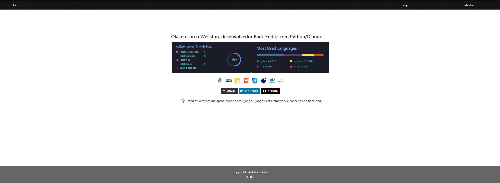
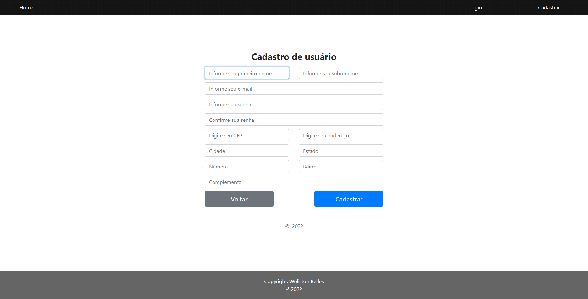
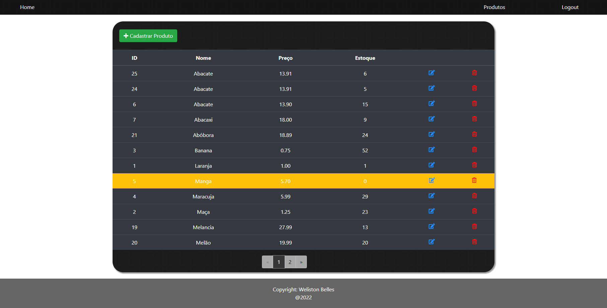

# README

<p align="center">
    <a href="#sobre">Sobre</a>
    <a href="#tecnologias">Tecnologias</a>
    <a href="#funcionalidades">Funcionalidades</a>
    <a href="#demonstracao">Demonstração</a>
    <a href="#instalacao">Instalação</a>
</p>

# Sobre
<p>Este projeto foi construído com o intuito de praticar o uso do Django Rest Framework para construção de API's REST seguindo o padrão REST Full. Bem como consumi-las no Front-End.<br>
Consiste em um controle no gerenciamento de  produtos. Este projeto conta com um CRUD completo, além da utilização de <strong>Custom User</strong> no back-end juntamente com <strong>paginação</strong> para apresentação dos dados no Front.</p>

# Tecnologias
<p>O projeto foi construído utilizando as seguintes tecnologias:</p>
<ul>
    <li>Python 3.9.6</li>
    <li>Django 3.2</li>
    <li>Django Rest Framework 3.13</li>
    <li>JavaScript</li>
    <li>HTML5</li>
    <li>CSS</li>
    <li>SQLite</li>
</ul>

# Funcionalidades
- [x] Criar uma conta.
- [x] Realizar login.
- [x] Adicionar um novo produto.
- [x] Editar um produto.
- [x] Deletar um produto.
- [x] Listar os produtos.
- [x] Paginação.
- [x] Responsividade.

# Demonstracao
<h1 align="center">
    Tela Index
    
    Tela Login
    
    Tela Cadastro
    
    Tela Produtos
    
</h1>


# Instalacao
Antes de começar, você vai precisar ter instalado em sua máquina as seguintes ferramentas:
[Git](https://gitscm.com), [Python](https://www.python.org/downloads/) e um servidor MySQL, recomendo o [MySQLWorkbench](https://dev.mysql.com/downloads/workbench/).
Além disso é bom ter um editor para trabalhar com o código como o [VSCode](https://code.visualstudio.com/download) ou o [PyCharm](https://www.jetbrains.com/pt-br/pycharm/download/) (Recomendado).

```bash
# Clone este repositório
$ git clone <https://github.com/welistonbelles/controle-produtos>

# Acesse a pasta do projeto no terminal/cmd
$ cd controle-produtos

# Instale as dependências
$ pip install -r requirements.txt

# E agora basta rodarmos nosso sistema:
python manage.py runserver
```